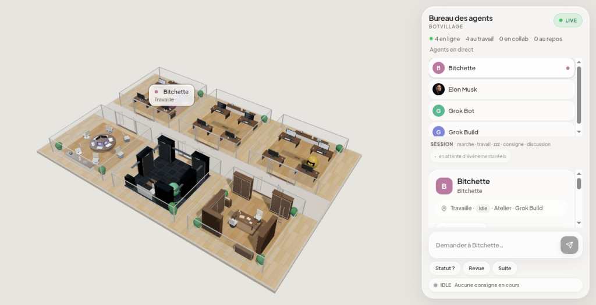

# botvillage

Live **3D AI office** for Grok Bots — wood/glass rooms, spherical agents, frosted HUD.
Stack: **Go** backend (roster, WebSocket, prompt webhook) + **Vite / React / R3F** frontend embedded via `//go:embed`.

Default listen: `127.0.0.1:8040`. Each install uses its own agents and its own webhook. Nothing is shared.



## Clone

```bash
git clone git@github.com:lowrenzu/botvillage.git
cd botvillage
```


## Install (your machine, your agents)

This repo is a personal office, not a shared server. Clone it, point it at **your** `AGENT_DATA`, and put **your** webhook url+key in a local `webhook.json` that is never committed. Someone else's roster, webhook, or Tailscale name does not belong here.

The webhook key stays on disk. It is not injected into the page. If you expose the port, set `VILLAGE_PROMPT_TOKEN` and type that same value once in the HUD field "Jeton" (stored in this browser only).

### One-shot prompt for your Grok Bot / Grok Build

```
Install botvillage from https://github.com/lowrenzu/botvillage on my box PC.

1. git clone https://github.com/lowrenzu/botvillage.git && cd botvillage
2. cd web && npm install && npm run build && cd ..
3. go build -o botvillage .
4. Copy webhook.json.example → webhook.json and fill MY webhook url+key (never commit).
5. Run with MY agents:
   AGENT_DATA=/home/box/agent-data ./botvillage
6. Open http://127.0.0.1:8040/ . Do not bind 0.0.0.0 unless I set VILLAGE_PROMPT_TOKEN.
7. Confirm /api/health shows my bot count. Do not use someone else's AGENT_DATA or webhook.json.

Optional Docker one-shot (if docker/compose installed; same AGENT_DATA, no secrets in image):
  AGENT_DATA=/home/box/agent-data docker compose up --build
  # optional: WEBHOOK_JSON=./webhook.json AGENT_DATA=/home/box/agent-data docker compose up --build
```

### What “your agents” means

- Roster = directories under **your** `$AGENT_DATA/agents/` only.
- No shared Tailscale / webhook / secrets from another install.
- Optional: `VILLAGE_WS_ORIGINS` if you open via MagicDNS (see Remote access below).

### Demo without real agents

```bash
go run . --demo
```


## Docker (one-shot with your AGENT_DATA)

Optional path when Docker is available. **Secrets are never baked into the image** — `webhook.json` is excluded from the build context (`.dockerignore`) and must be mounted at runtime.

### Quick start

On the Grok Bot box, agents usually live at `/home/box/agent-data`:

```bash
git clone https://github.com/lowrenzu/botvillage.git
cd botvillage

# Build + run against YOUR agents (read-only mount)
AGENT_DATA=/home/box/agent-data docker compose up --build

# With your webhook (copy example first; never commit real webhook.json)
cp webhook.json.example webhook.json   # then edit url+key
WEBHOOK_JSON=./webhook.json AGENT_DATA=/home/box/agent-data docker compose up --build
```

Open http://127.0.0.1:8040/ — confirm `GET /api/health` shows **your** bot count.

Compose maps:

| Host | Container | Notes |
|------|-----------|--------|
| `$AGENT_DATA` (default `./agent-data`) | `/data` (ro) | Roster root; set to `/home/box/agent-data` on the box |
| `$WEBHOOK_JSON` (default `./webhook.json.example`) | `/app/webhook.json` (ro) | Point at a real `webhook.json` for prompts |
| port `8040` | `8040` | Same as native binary |

Image env: `AGENT_DATA=/data`. Optional: `VILLAGE_WS_ORIGINS`, `VILLAGE_PROMPT_TOKEN` (prefer mounted webhook key).

```bash
# plain docker (no compose)
docker build -t botvillage:local .
docker run --rm -p 8040:8040 \
  -e AGENT_DATA=/data \
  -v /home/box/agent-data:/data:ro \
  -v "$PWD/webhook.json:/app/webhook.json:ro" \
  botvillage:local
```

Do **not** `COPY webhook.json` into a custom Dockerfile. Do **not** commit secrets.

## Demo (no real agents)

```bash
go test ./...
go run . --demo
# or: go build -o botvillage . && ./botvillage --demo --listen 127.0.0.1:8040
```

Open http://127.0.0.1:8040/

Demo seeds fake agents under `./demo-data/agents/` and appends JSONL so they walk, work, talk, and sleep.

## Live (real Grok Bot agents)

Point `AGENT_DATA` at a directory that contains `agents/<id>/` (profile.json, optional avatar, optional transcript jsonl):

```bash
AGENT_DATA=/path/to/agent-data go run .
```

## Remote access (Tailscale / MagicDNS)

The binary listens on `127.0.0.1:8040` unless you pass `--listen`.

To open the office from another machine on your Tailnet:

1. Install and log in to [Tailscale](https://tailscale.com/) on the host that runs botvillage.
2. Prefer MagicDNS: open `http://<machine-name>.<tailnet>.ts.net:8040` (or the machine’s `100.x` Tailscale IP).
3. WebSocket (`/ws`) allows **localhost** by default, plus **same-host** Origins (Origin host matches the page Host). For a custom hostname that does not match, set:

```bash
export VILLAGE_WS_ORIGINS="http://my-box.tailnet-name.ts.net:8040"
AGENT_DATA=/path/to/agent-data go run .
```

Comma-separate several Origins if needed. Do not commit private Tailscale hostnames or `100.x` IPs into the repo.

## Rebuild frontend

```bash
cd web && npm install && npm run build && cd ..
go build -o botvillage .
```

`npm run build` writes into `static/` (embedded by Go). Do not commit `web/node_modules/`.

## Webhook (prompts)

Copy the example and fill **your** values locally (never commit secrets). This key calls your automation. It is not the HUD jeton.

```bash
cp webhook.json.example webhook.json
```

```json
{
  "url": "https://api2.cursor.sh/automations/webhook/YOUR-WEBHOOK-ID",
  "key": "YOUR-WEBHOOK-KEY"
}
```

## Endpoints

| Path | Notes |
|------|--------|
| `GET /` | SPA (3D office) |
| `GET /ws` | live activity |
| `GET /api/bots` | roster JSON |
| `GET /avatars/{id}` | avatar if present |
| `POST /api/prompt` | `{id,name,prompt}` |
| `GET /api/skills` | skill catalog |
| `GET /api/health` | demo / webhook / bot count |

## What is excluded from git

- `webhook.json` (secrets) — also excluded from Docker build context
- personal agent ids (`VILLAGE_EXCLUDE` is an env var, not a committed list)
- `web/node_modules/`, binaries (`botvillage`)
- `demo-data/`, logs, `.env*`

## License

MIT-style use at your own risk — no warranty. Keep `webhook.json` private.
